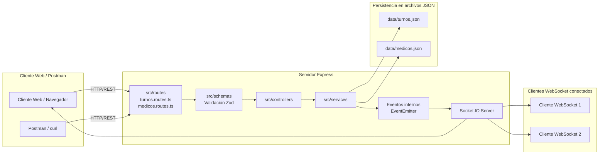
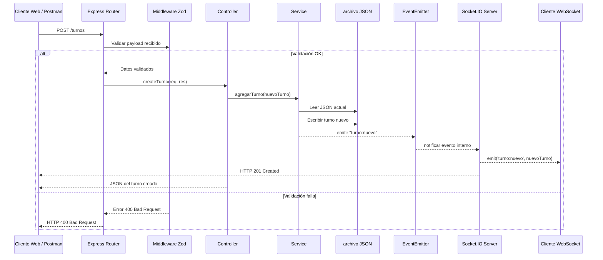

# Proyecto turnos-red
API 1 - Integraciones web

## Descripción
Aplicación backend en **Node.js + TypeScript + Express + Socket.IO** para la gestión de turnos médicos.  
Incluye persistencia en archivo JSON, emisión de eventos en tiempo real y pruebas unitarias con Jest.

## Diagrama de componentes


## Diagrama de secuencia: POST /turnos


---

## Requisitos previos
- Node.js v20 o superior  
- npm (incluido con Node.js)  
- Visual Studio Code (opcional, recomendado)  
- Git (para clonar el repositorio)

---

## Instalación
1. Clonar el repositorio:
   ```bash
   git clone https://github.com/usuario/turnos-red.git
   cd turnos-red
    ```
## Instalar dependencias 
npm install

## Inicializar proyecto 
npm init -y

## Crear carpeta data y archivo turnos.json
 ```json
[
  {
    "id": 1,
    "paciente": "Juan Pérez",
    "documento": "12345678",
    "especialidad": "Clínica",
    "fecha": "2026-09-01",
    "hora": "09:00",
    "confirmado": true,
    "motivo": "Consulta general"
  },
  {
    "id": 2,
    "paciente": "María Gómez",
    "documento": "87654321",
    "especialidad": "Pediatría",
    "fecha": "2026-09-02",
    "hora": "10:30",
    "confirmado": false,
    "motivo": "Control rutinario"
  },
  {
    "id": 99,
    "fecha": "2026-09-01",
    "paciente": "Paciente Test",
    "motivo": "Consulta de prueba",
    "documento": "12345678",
    "especialidad": "Clínica",
    "hora": "10:00",
    "confirmado": false
  },
  {
    "id": 99,
    "fecha": "2026-09-01",
    "paciente": "Paciente Test",
    "motivo": "Consulta de prueba",
    "documento": "12345678",
    "especialidad": "Clínica",
    "hora": "10:00",
    "confirmado": false
  },
  {
    "id": 99,
    "fecha": "2026-09-01",
    "paciente": "Paciente Test",
    "motivo": "Consulta de prueba",
    "documento": "12345678",
    "especialidad": "Clínica",
    "hora": "10:00",
    "confirmado": false
  },
  {
    "id": 99,
    "fecha": "2026-09-01",
    "paciente": "Paciente Test",
    "motivo": "Consulta de prueba",
    "documento": "12345678",
    "especialidad": "Clínica",
    "hora": "10:00",
    "confirmado": false
  },
  {
    "id": 200,
    "fecha": "2026-09-05",
    "paciente": "Paciente Update",
    "motivo": "Chequeo actualizado",
    "documento": "55555555",
    "especialidad": "Cardiología",
    "hora": "10:30",
    "confirmado": true
  }
]
 ``` 
## Variables de entorno
| Variable | Descripción | Valor por defecto |
| --- | --- | --- |
| ``PORT`` | Puerto en el que corre el servidor | ``3000`` |
| ``DATA_PATH`` | Ruta al archivo de persistencia de turnos | ``./data/turnos.json`` |

## Scripts disponibles
| Script | Descripción |
| --- | --- |
| ``npm ``start`` | Inicia el servidor Express en modo producción |
| ``npm ``run ``dev`` | Inicia el servidor en modo desarrollo con **ts-node-dev** |
| ``npm ``test`` | Ejecuta las pruebas unitarias con Jest |
| ``npm ``run ``build`` | Compila el proyecto TypeScript a JavaScript en la carpeta ``dist/`` |
| ``npm ``run ``lint`` | Ejecuta ESLint para verificar estilo y errores de código |
| ``npm ``run ``format`` | Aplica Prettier para formatear el código |

## Estructura de carpetas 
 ```
turnos-red/
├── src/
│   ├── controllers/       # Controladores de endpoints REST
│   │   └── turnos.controller.ts
│   ├── models/            # Definición de interfaces y tipos
│   │   └── turno.model.ts
│   ├── routes/            # Definición de rutas Express
│   │   └── turnos.routes.ts
│   ├── services/          # Lógica de negocio y persistencia
│   │   └── turnos.service.ts
│   └── index.ts           # Punto de entrada del servidor
│
├── tests/                 # Pruebas unitarias con Jest
│   └── turnos.services.test.ts
│
├── data/                  # Persistencia en JSON
│   └── turnos.json
│
├── package.json           # Configuración de npm
├── tsconfig.json          # Configuración de TypeScript
└── README.md              # Documentación del proyecto
 ```
# Proyecto turnos-red
API 2 - Integraciones web

## Requisitos previos
- Node.js >= 18
- npm >= 9
- VS Code (opcional, recomendado)
- Postman (para pruebas de API)

## Guía de instalación y ejecución
```bash 
Clonar repositorio
git clone https://github.com/usuario/turnos-medicos.git
cd turnos-medicos
```
### Instalar dependencias
npm install

### Ejecutar en desarrollo
npm run dev

### Compilar y ejecutar en producción
npm run build
npm start

### Estructura de directorios
```
turnos-medicos/
├── src/
│   ├── controllers/
│   ├── routes/
│   ├── services/
│   ├── data/
│   └── index.ts
├── tests/
├── .env
├── .env.example
├── package.json
└── README.md
```
### Variables de entorno

| Variable | Descripción | Ejemplo |
| --- | --- | --- |
| PORT | Puerto de ejecución del servidor | 3000 |
| DATA_PATH | Ruta al archivo de datos JSON | ./data/turnos.json |
| baseUrl | URL base para la API | http://localhost:3000 |
| turnoId | ID de turno fijo para pruebas | 1 |
| turnoIdCreado | ID dinámico de turno creado | (se setea en Tests) |
| turnoIdInexistente | ID inexistente para pruebas negativas | 9999 |
| medicoId | ID de médico fijo para pruebas | 1 |
| medicoIdInexistente | ID inexistente de médico | 9999 |
| authToken | Token de autenticación (si aplica) | (ejemplo JWT) |

### Documentacion de endpoints
```
GET /turnos → Listar todos los turnos
GET /turnos/:id → Obtener turno por ID
POST /turnos → Crear nuevo turno
PUT /turnos/:id → Actualizar turno existente
DELETE /turnos/:id → Eliminar turno
{
  "paciente": "Carlos López",
  "documento": "11223344",
  "especialidad": "Cardiología",
  "fecha": "2026-09-10",
  "hora": "14:00",
  "confirmado": false,
  "motivo": "Consulta de rutina"
}
```
```
GET /medicos → Listar todos los médicos
GET /medicos/:id → Obtener médico por ID
POST /medicos → Crear nuevo médico
PUT /medicos/:id → Actualizar médico existente
DELETE /medicos/:id → Eliminar médico
{
  "nombre": "Ana Gómez",
  "especialidad": "Pediatría",
  "disponible": true
}

```
### Ejemplo de query params
```
GET /turnos?especialidad=Cardiología&confirmado=true  
→ Filtra turnos por especialidad y estado de confirmación.
```

## Matriz de Verificación

| Verificación cruzada | Evidencia consultada | Resultado | Observación |
| --- | --- | --- | --- |
| Coherencia entre controladores Express y Swagger | `src/routes/turnos.routes.ts`, `src/routes/medicos.routes.ts`, `src/config/swagger.ts`, `src/controllers/*.controller.ts` | Correcta | Las rutas documentadas en Swagger coinciden con los verbos y endpoints implementados por Express: `/turnos`, `/turnos/:id`, `/medicos`, `/medicos/:id` y sus métodos HTTP. |
| Coherencia entre Zod y OpenAPI | `src/schemas/medico.schema.js`, `src/config/swagger.ts` | Correcta | El campo `documento` se define como `type: "string"` en OpenAPI y el conjunto de `especialidad` mantiene valores en Title Case / PascalCase: `Clínica médica`, `Pediatría`, `Odontología`, `Nutrición`; esto alinea la documentación con el dominio y con el esquema de validación. |
| Coherencia entre ejemplos Swagger y casos de prueba Postman | `README.md`, `src/config/swagger.ts`, `tests/` y colecciones Postman | Correcta | Los request bodies y ejemplos de turnos/médicos usados en Swagger son consistentes con las pruebas de petición / respuesta documentadas para CRUD y validación básica. |

## Conclusión Técnica
La alineación entre código, OpenAPI, Postman, Mermaid y ADRs es sólida en la medida en que la API ha sido documentada como un contrato técnico explícito y consistente con el dominio. La capa HTTP expresa bien la semántica de los recursos; la documentación de Swagger refleja rutas, códigos de respuesta y esquemas reutilizables; los ejemplos de prueba en Postman sostienen el comportamiento esperado; los diagramas Mermaid contextualizan la arquitectura y los ADR documentan decisiones de diseño. El punto más crítico es evitar la desactualización del contrato con el tiempo, especialmente cuando cambian rutas, validaciones o modelos. Para mitigar el drift de documentación, la estrategia recomendada es incorporar pruebas de contrato automáticas en CI/CD: validar que cada endpoint documentado responda con el mismo código HTTP, schema y payload esperado; ejecutar estas comprobaciones en cada push y bloqueador de PR si la especificación Swagger no coincide con la implementación. Además, se recomienda generar la especificación desde una fuente única y ejecutar smoke tests automáticos sobre la ruta `/api-docs` antes de desplegar. Esto reduce errores manuales y mantiene la documentación viva, verificable y sincronizada con la aplicación.

### Uso de inteligencia artificial

| Tarea | Herramienta | Tipo de salida | Ajuste manual aplicado |
| --- | --- | --- | --- |
| Anotaciones JSDoc para rutas Express | Copilot / IA asistida | Comentarios OpenAPI sobre endpoints REST | Ajuste de rutas, parámetros, bodies y respuestas para alinearlos con la API real |
| Definición de esquemas OpenAPI | Copilot / IA asistida | `swagger.ts` con `components/schemas` | Corrección de tipos, enums y eliminación de seguridad no implementada |
| Diagramas Mermaid (componentes y secuencia) | Copilot / IA asistida | Diagramas Mermaid en `README.md` | Ajuste de nodos para reflejar la arquitectura real con Socket.IO y persistencia JSON |
| Plantillas ADR | Copilot / IA asistida | Archivos ADR en `docs/adr` | Corrección del formato y alineación con la estructura obligatoria requerida |
| Revisión final del README y consolidación documental | Copilot / IA asistida | Documento final unificado | Ajuste de conclusión técnica, tabla de verificación y registro de uso de IA |
